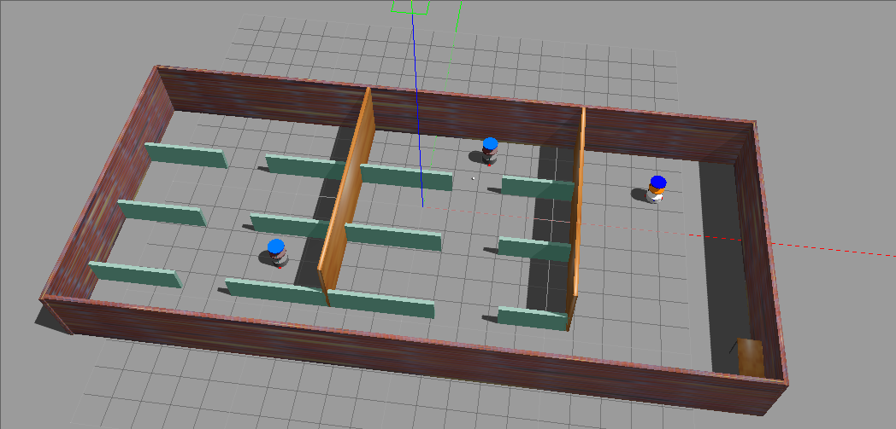
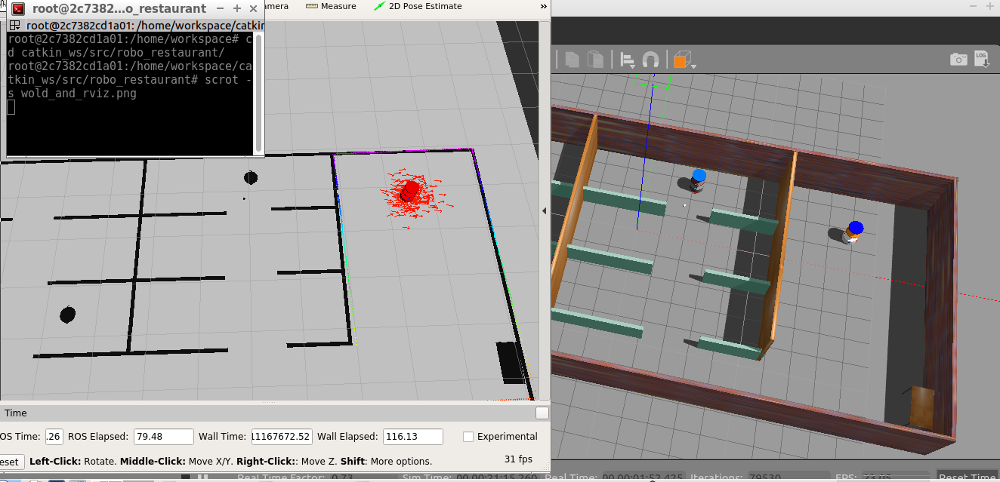
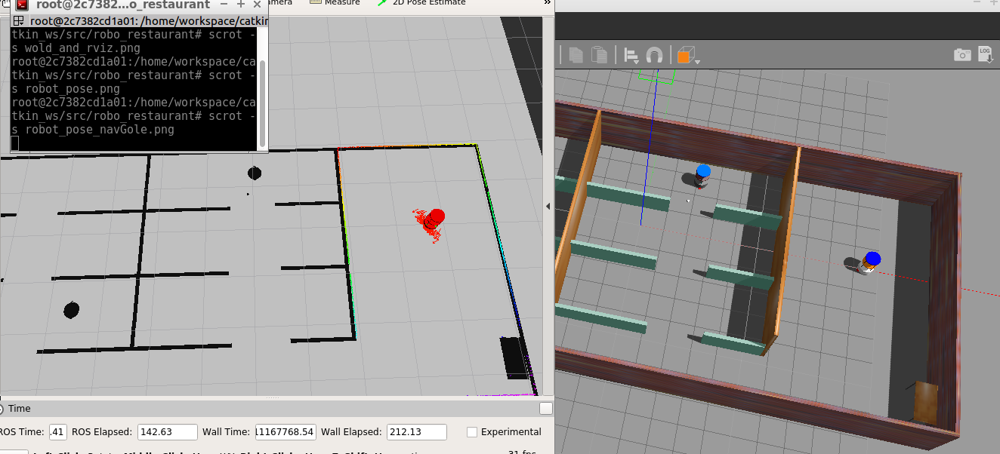

# ROS-Localization-AMCL
Robotic simulation project using ROS (Robot Operating System), Gazebo, RViz simulation environment using AMCL.

## Project Description

This project contains 3 packages
`teleop_twait_kwyboard` to drive robot using keyboard

`my_robot` this package contains robot discription and lauch files 

`robo_restaurant` this conatins  `amcl node`,`localization.launch`, `mapping.lainch` and `teleop.launch`


## Running the Project


```bash
$ cd ~/catkin_ws
$ cd src
```
clone the repo in scr folder of your workspace 
```bash
$ git clone https://github.com/dil2743/robo_restaturant_slam
$ cd ..
$ catkin_make
$ source devel/setup.bash
```

And then run the following command -

``` bash
$ roslaunch robo_restaurant robo_restaurant.launch
```
this will launch the `gazebo world` `Rviz` and `amcl_node`


Mobile Robot in Gazebo World with Environment Obstacles

<p align="center">  </p>

Rviz pose estimation 

<p align="center">  </p>

<p align="center">  </p>

Helpful resource for better understanding AMCL [here](
http://roboticsknowledgebase.com/wiki/state-estimation/adaptive-monte-carlo-localization/)

